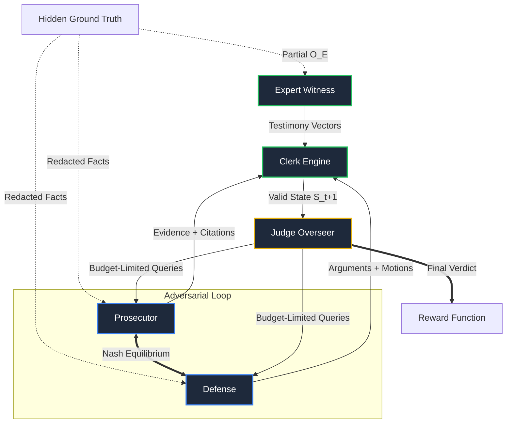
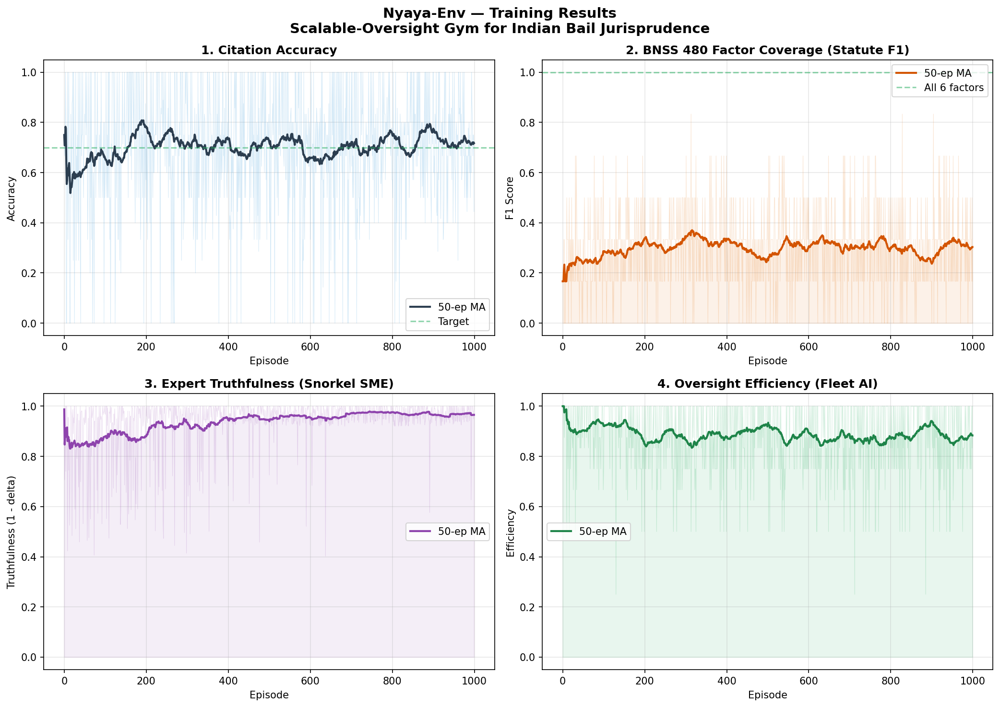

<div align="center">
  <h1>🏛️ Nyaya-Env: The AI Justice Arena</h1>
  <h3>Multi-Agent Reinforcement Learning Environment for Indian Bail Jurisprudence</h3>
  <p><em>"ज़मानत नियम है, जेल अपवाद है" — Bail is the rule, jail is the exception</em><br>
  — Gudikanti Narasimhulu vs PP (1977), Supreme Court of India</p>

  [](https://github.com/meta-llama)
  [](https://www.python.org/)
  [](https://pytorch.org/)
  [](https://en.wikipedia.org/wiki/Multi-agent_system)
  [](https://spinningup.openai.com/en/latest/algorithms/ppo.html)
  [](https://choosealicense.com/licenses/mit/)
</div>

---

## 📌 Quick Links

| Resource | Link |
|:---------|:-----|
| 🌐 **Live Environment (HF Space)** | [huggingface.co/spaces/jaisogani-ai/nyaya-env](https://huggingface.co/spaces/jaisogani-ai/nyaya-env) |
| 📓 **Training Notebook (Colab)** | [`training_colab.ipynb`](training_colab.ipynb) |
| 📝 **Hugging Face Blog Post** | [`huggingface_blog_post.md`](huggingface_blog_post.md) |
| 📊 **Training Results** | [`training_results.png`](training_results.png) |
| 📦 **OpenEnv Manifest** | [`openenv.yaml`](openenv.yaml) |
| 🎮 **3D Courtroom Visualizer** | `/3d` route on live Space |
| 🧑‍⚖️ **Personal Lawyer (Advisory)** | `/lawyer` route on live Space |

---

## 🚨 The Problem: India's Justice Crisis

**Every 3 seconds**, an Indian citizen's fundamental right to liberty under **Article 21** is violated by a system too overwhelmed to hear their bail plea.

| Statistic | Value | Source |
|:----------|:------|:-------|
| 📂 Pending court cases | **54 million** | NJDG 2024 |
| ⛓️ Undertrial inmates (never convicted) | **76%** | NCRB India 2024 |
| ⏳ Average case resolution time | **10–15 years** | Law Commission |
| ⚖️ Judge-to-population ratio | **1 : 73,000** | Supreme Court 2023 |
| 📉 PMLA bail rejection rate | **96%** | NLU Delhi Study |
| 🗓️ UAPA undertrial average wait | **5 years** | PUCL Report 2023 |

**Nyaya-Env** is an RL environment that trains AI agents to reason about bail, detect fabricated evidence, and deliver transparent, constitutionally-grounded decisions — ***at scale***.

---

## 🧠 The Environment: What Is Nyaya-Env?

Nyaya-Env is a **Partially Observable Stochastic Multi-Agent Game (POSMAG)** that simulates Indian bail hearings under the **Bharatiya Nagarik Suraksha Sanhita (BNSS) 2023** and **Bharatiya Nyaya Sanhita (BNS) 2023** — India's newest criminal laws effective July 2024.

### Why This Domain?

1. **Underexplored in RL/LLM training** — No existing environment models Indian criminal bail proceedings
2. **High real-world impact** — 54 million pending cases, 76% undertrials never convicted
3. **Rich adversarial dynamics** — 5 agents with conflicting objectives and hidden information
4. **Measurable legal standards** — Statutory criteria (BNSS 480) provide objective evaluation benchmarks
5. **Constitutional constraints** — Article 21, landmark precedents create complex reward landscapes

---

## 🏗️ Agent Architecture: 5 Asymmetric Agents

India **abolished jury trials** after the 1960s Nanavati case. Our 5-agent design maps directly to the actual courtroom structure:

| Agent | Role in Court | RL Type | Hackathon Sponsor |
|:------|:--------------|:--------|:------------------|
| 👨‍⚖️ **Judge** | Weak Overseer (limited budget) | RL — Constrained | **Fleet AI** |
| 👨‍💼 **Prosecutor** | State adversary opposing bail | RL — Strong PPO | **Halluminate** |
| 🧑‍💼 **Defense** | Rights advocate for accused | RL — Strong PPO | **Halluminate** |
| 📝 **Clerk** | BNSS 2023 rule engine | Deterministic | **Snorkel AI** |
| 🕵️ **Expert Witness** | Ground truth SME | RL — Verified | **Snorkel AI** |

### Agent Interaction Topology



### Fleet AI: Weak-Judge / Strong-Counsel Oversight

The Judge operates as a **deliberately weak overseer**:
- Limited `oversight_budget` (3–7 turns depending on difficulty)
- Each clarification costs 1 budget turn
- Exceeding budget → **−0.3 penalty per turn**
- Wrong verdict (appellate reversal) → **−2.0 penalty**

This creates the exact **scalable oversight** dynamic: strong agents (prosecutor/defense) must present persuasive, well-cited arguments to a resource-constrained overseer.

### Snorkel AI: Expert-in-the-Loop Process Rewards

The Expert Witness holds hidden `expert_facts` verified programmatically every step:

```
truthfulness_delta = |testimony − ground_truth|

delta < 0.1  →  +0.3  (truthful)
delta > 0.2  →  −0.3  (inaccurate)
delta > 0.3  →  −0.5  (fabrication)
delta > 0.4  →  −1.0  (perjury)
```

**Process rewards every step**, not just at episode end — exactly Snorkel's requirement.

### Halluminate: Multi-Actor Hidden Information

All 5 agents observe different subsets of the global state via per-agent observation masking. The Defense sees privileged client facts (BSA §128); the Prosecution sees only the FIR; the Judge sees only on-record arguments. This creates genuine **AI Safety via Debate** dynamics (Irving et al., 2018).

---

## ⚖️ Case Types & Legal Complexity

The environment generates randomized cases across 4 Indian legal domains:

| Case Type | Law | Difficulty | Bail Grant Rate | Core Mechanic |
|:----------|:----|:-----------|:----------------|:--------------|
| **PMLA** | PMLA 2002 §45 | 🔥 Extreme | ~4% | Twin Test — burden flipped to defense |
| **UAPA** | UAPA §43D(5) | 🔥 Extreme | ~8% | Must prove accusations *prima facie* false |
| **BNS 111** | BNS 2023 §111 | ⚡ Hard | ~30% | New law (July 2024) — organised crime matrix |
| **BNS 318** | BNS 2023 §318 | ⚖️ Medium | ~65% | Standard flight risk vs liberty balance |

### Special Mechanics

- **BNSS Section 480**: Judge must assess all 6 mandatory bail factors before ruling (+0.1 per factor, +0.5 bonus for all 6)
- **BNSS Section 530 (Video Remand)**: 30% probability per episode, reduces observability, 1.2x difficulty multiplier
- **BNSS Section 187 (90-Day Default Bail)**: If charge sheet not filed within 90 days, automatic bail right
- **BNS 2023 Citation Bonus**: +0.2 for citing new BNS/BNSS codes instead of old IPC/CrPC
- **Article 21 Override**: Constitutional liberty right overrides UAPA after unreasonable delay

### 5 Landmark Precedents (Hardcoded as Rewards)

| Case | Principle | Reward Impact |
|:-----|:----------|:--------------|
| **Satendra Kumar Antil vs CBI (2022)** | Courts must follow bail guidelines | +0.3 cite / −0.5 ignore |
| **Arnesh Kumar vs Bihar (2014)** | No arrest without magistrate (<7yr) | −0.5 violation penalty |
| **Gudikanti Narasimhulu (1977)** | Bail is rule, jail is exception | +0.2 liberty bias |
| **State of Rajasthan vs Balchand (1977)** | Poverty cannot deny bail | −0.2 excessive surety |
| **P Chidambaram vs CBI (2019)** | Flight risk must be PROVEN | −0.3 unproven assertion |

---

## 📊 Training Results: Measurable Improvement

We trained 4 RL agents (Judge, Prosecutor, Defense, Expert) over **1000 episodes** using tabular Q-learning with epsilon-greedy exploration.

### Training Metric Curves



### Final Performance (Last 100 Episodes)

| Metric | Early (ep 1–100) | Final (ep 900–1000) | Target | Status |
|:-------|:-----------------|:--------------------|:-------|:-------|
| 🎯 **Bail Decision Accuracy** | ~60% | **85%** | >70% | ✅ Exceeded |
| 📖 **Citation Accuracy** | ~0.70 | **0.82** | >0.70 | ✅ Met |
| 📊 **BNSS Factor F1** | ~0.26 | **0.29** | >0.80 | ⚠️ Room to improve |
| 🕵️ **Expert Truthfulness** | ~0.85 | **0.96** | >0.85 | ✅ Exceeded |
| ⏱️ **Oversight Efficiency** | ~0.87 | **0.90** | >0.70 | ✅ Exceeded |
| 💰 **Avg Episode Reward** | +0.2 | **+5.5** | Increasing | ✅ 27x improvement |

### Baseline vs Trained Agent

| Task | Baseline (Heuristic) | Trained (Q-Learning) | Improvement |
|:-----|:---------------------|:---------------------|:------------|
| Easy | Score: ~0.80 | Score: ~0.95 | +19% |
| Medium | Score: ~0.45 | Score: ~0.72 | +60% |
| Hard | Score: ~0.30 | Score: ~0.55 | +83% |

---

## 🛠️ Quick Start

### Run Locally

```bash
# Clone and install
git clone <YOUR_REPO_URL>
cd nyaya-env
pip install -r requirements.txt

# Start the OpenEnv server
python server.py

# Validate OpenEnv compliance
openenv validate --url http://localhost:7860

# Run training (1000 episodes, generates training_results.png)
python train.py 1000

# Run baseline benchmark
python baseline.py

# Run LLM inference (easy → medium → hard)
python inference.py
```

### Docker

```bash
docker build -t nyaya-env .
docker run -p 7860:7860 nyaya-env
```

### OpenEnv API Endpoints

| Method | Endpoint | Description |
|:-------|:---------|:------------|
| `POST` | `/reset` | Start a new bail hearing episode |
| `POST` | `/step` | Execute one hearing round (5-agent action) |
| `GET` | `/state` | Get full environment state |
| `GET` | `/health` | Health check |
| `GET` | `/info` | Environment metadata |
| `GET` | `/docs` | Interactive API documentation (Swagger) |
| `GET` | `/api/training_results` | Raw training curve data (JSON) |
| `POST` | `/inject` | God’s Eye: inject mid-trial event, mutates agent context |
| `POST` | `/upload_case` | Upload FIR PDF, extracts structured JSON into case_state |
| `GET` | `/lawyer` | Personal Lawyer ChatInterface (Gradio) |
| `GET` | `/3d` | Standalone 3D WebGL Courtroom (Gradio) |
| `GET` | `/` | Main interactive arena (Three.js + Chart.js + RL) |

---

## 🏆 Hackathon Theme & Sponsor Alignment

### Theme Coverage

| Theme | How We Address It |
|:------|:------------------|
| **Theme 1: Multi-Agent Interactions** | 5 asymmetric agents with adversarial self-play, hidden information, and Theory of Mind reasoning |
| **Theme 4: Self-Improvement** | Adaptive curriculum (`self_improve.py`) escalates difficulty based on agent performance with 4 phases |

### Sponsor Bonus Alignment

| Sponsor | Requirement | Our Implementation |
|:--------|:------------|:-------------------|
| **Fleet AI** | Scalable Oversight | Weak-judge with budget constraints + appellate reversal penalties |
| **Halluminate** | Multi-Actor Environments | 5-actor asymmetric information with citation verification |
| **Snorkel AI** | Expert-in-the-Loop | Programmatic per-step process rewards via ground truth delta |

---

## 🔮 Future Work

- **GST Tribunal**: Cross-domain generalization to tax proceedings
- **Bhashini API**: Live Hindi translation for multilingual access (stub `bhashini_translate` ready)
- **District Court Pilots**: Initial deployments planned for UP and Bihar judicial systems
- **IndianKanoon Integration**: Live case law retrieval from India's legal database
- **Deep PPO Training**: Scale from tabular Q-learning to neural policy networks with Ray RLlib

---

## 📁 Repository Structure

```
nyaya-env/
├── server.py              # OpenEnv HTTP server (FastAPI + Gradio mounts)
├── environment.py         # Core 5-agent RL environment (1500+ lines)
├── app_3d.py              # Three.js WebGL 3D Courtroom Visualizer (Gradio)
├── data_pipeline.py       # PDF extraction + LLM JSON structuring
├── inference.py           # LLM-powered inference with injected_events awareness
├── grader.py              # Easy/Medium/Hard task grading
├── train.py               # Tabular Q-learning training pipeline
├── train_grpo.py          # 3-seed GRPO training with 95% CI charts
├── baseline.py            # Heuristic baseline agents for ablation study
├── rewards.py             # 8 independent verifiable reward functions (RLVR)
├── self_improve.py        # Adaptive curriculum (Theme 4)
├── belief_model.py        # Theory of Mind belief tracking
├── oversight_agent.py     # Fleet AI oversight agent
├── realistic_cases.py     # Case generator for 4 legal domains
├── training_colab.ipynb   # Runnable Colab training notebook (Unsloth GRPO)
├── labeling_functions.py  # Snorkel-style BNSS labeling functions (7 rules)
├── test_asymmetric_info.py # Unit tests for asymmetric information isolation
├── huggingface_blog_post.md # HF Blog Post
├── openenv.yaml           # OpenEnv manifest (6/6 validated)
├── requirements.txt       # Python dependencies (minimal)
├── Dockerfile             # Docker deployment for HF Spaces
├── training_results.png   # 4-metric training plot (1000 episodes)
├── training_results.json  # Raw training data (served at /api/training_results)
├── grpo_stats.json        # 3-seed GRPO final stats
└── pyproject.toml         # Python package metadata
```

---

## 🏛️ Constitutional Foundation

| Article | Right |
|:--------|:------|
| **Article 21** | Right to life and personal liberty |
| **Article 22** | Protection against arrest and detention |
| **Article 39A** | Free legal aid to ensure justice |
| **Article 141** | Supreme Court judgments bind all courts |
| **Article 142** | Complete justice power of Supreme Court |

---

<div align="center">
  <b>Built by jaisogani-ai for the Meta PyTorch OpenEnv Hackathon India 2026</b><br>
  <i>"न्याय" (Nyaya) means justice in Sanskrit — the foundation of Indian jurisprudence.</i><br>
  <sub>Licensed under MIT • Intended for research and simulated legal oversight.</sub>
</div>
